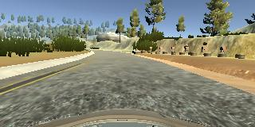
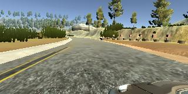
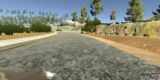

Behaviorial Cloning Project
===========================

[Self-Driving Car Engineer Nanodegree Program](http://www.udacity.com/drive)

Description
-----------

This repository contains starting files for the Behavioral Cloning Project.

In this project, deep neural networks and convolutional neural networks will be
used to clone driving behavior. Model training, validation and testing will be
done using Keras. The model will output a steering angle to an autonomous
vehicle.

A simulator where you can steer a car around a track for data collection has
been provided by Udacity. Image data and steering angles will be used to train a
neural network and then use this model to drive the car autonomously around the
track. The goals of this project are:

-   Use the simulator to collect data of good driving behavior

-   Design, train and validate a model that predicts a steering angle from image
    data

-   Use the model to drive the vehicle autonomously around the first track in
    the simulator. The vehicle should remain on the road for an entire loop
    around the track.

Dependencies
------------

This lab requires:

-   [CarND Term1 Starter
    Kit](https://github.com/udacity/CarND-Term1-Starter-Kit)

The lab enviroment can be created with CarND Term1 Starter Kit. Click
[here](https://github.com/udacity/CarND-Term1-Starter-Kit/blob/master/README.md)
for the details.

The simulator can be downloaded from the classroom. In the classroom, sample
data that you can optionally use to help train your model is also available.

Implementation and model architecture design
--------------------------------------------

This project includes the following files:

-   `model.py` containing the script to create and train the model

-   `drive.py` for driving the car in autonomous mode

-   `model.h5` containing a trained convolution neural network

### Model Architecture and Training Strategy

#### 1. An appropriate model architecture has been employed

My model consists of a convolution neural network that leveraged on 5
convolutional layers and 4 fully connected layers. ReLu functions were used to
introduce non linearities. When new training data was added, the weights of the
model calculated from previous training were used as a starting point, applying
what it is called “transfer learning”. The network has about 27 million
connections and 250 thousand parameters.

#### 2. Attempts to reduce overfitting in the model

The model was trained and validated on different data sets to ensure that the
model was not overfitting. Attempts to reduce overfitting consist to monitor the
training set and validation set accuracy evolution during the training and to
choose an adequate number of epochs. The model was tested by running it through
the simulator and ensuring that the vehicle could stay on the track.

#### 3. Model parameter tuning

During model training Adam optimizer was used. The correction factor used for
the left and right images was initially set to 0.2 and later amended to 0.15.
The images in the model were cropped on the top and bottom by (70,25) and later
on resized to (40,160). Batch size was 32 images, even if the entries processed
in each batch were only 8. (center, center flipped, left and right images for
each entry). I started with 5 epochs of training and after seeing that the
validation accuracy was not increasing anymore after the third, I fine tuned it
to 3.

#### 4. Appropriate training data

Training data was chosen to keep the vehicle driving on the road. I used the one
provided by udacity + a combination of center lane driving, recovering from the
left and right sides of the road and driving the track in the opposite
direction.

#### 5. Solution Design Approach

The overall strategy for the solution was to actually leverage on existing
models that actually proved to work fine in the recognition of the steering
angles based on the input images. After a data cropping, resizing and
normalization process of the images I started using the model proposed by
NVIDIA:

https://images.nvidia.com/content/tegra/automotive/images/2016/solutions/pdf/end-to-end-dl-using-px.pdf

In order to gauge how well the model was working, I split my image and steering
angle data into a training and validation set. To augment the data I initially
flipped the center image, doubling the amount of data provided by udacity.

Still, the model was not working sufficiently well, and I decided to leverage
also on the left and right images with a costant correction factor, initially
set to 0.2 and after some tests to 0.15.

The final step was to run the simulator to see how well the car was driving
around track one. There were a few spots where the vehicle fell off the track.
To improve the driving behavior in these cases, I added new training data that I
recorded myself.

At the end of the process, the vehicle is able to drive autonomously around the
track without leaving the road.

#### 2. Final Model Architecture

The final model architecture (model.py lines 18-24) consisted of a convolution
neural network with the following layers and layer sizes ...

-   24 5x5 filters, 2x2 strides, valid padding (ReLu Activation),

-   36 5x5 filters, 2x2 strides, valid padding (ReLu Activation)

-   48 5x5 filters, 2x2 strides, valid padding (ReLu Activation)

-   64 3x3 filters, 1x1 strides, valid padding (ReLu Activation)

-   64 3x3 filters, 1x1 strides, valid padding (ReLu Activation)

-   Flatten layer

-   Fully connected (input size: 1164; output size:100)

-   Fully connected (input size: 100; output size:50)

-   Fully connected (input size: 50; ouput size: 10)

-   Fully connected (input size 10; output size: 1)

#### 3. Creation of the Training Set & Training Process

Besides the training data provided by Udacity, I recorded 1 lap (straight) with
center driving, 1 lap (inverse direction) with center driving, and 1 lap focused
only on recovering. I had to focus in particular on the last curve, which
required a bit of time to pass it. For all the data collected I used the center
camera image, the center flipped and the corrected left and right.

Centered image example:

Left image example:

Right image example:

After the collection process, I had circa 50k images to be processed (12K
entries). I then preprocessed this data by normalizing it, cropping and resizing
it to fit the memory. I finally randomly shuffled the data set and put 20% of
the data into a validation set.

I used this training data for training the model. The validation set helped
determine if the model was over or under fitting. The ideal number of epochs was
3 as evidenced by the validation accuracy not increasing anymore after it.

The training process took place on a AWS instance in order to have more
computational power and speed up the training.

Results and further improvements
--------------------------------

Using the Udacity provided simulator and the `drive.py` file, the car can be
driven autonomously around the track by executing

~~~~~~~~~~~~~~~~~~~~~~~~~~~~~~~~~~~~~~~~~~~~~~~~~~~~~~~~~~~~~~~~~~~~~~~~~~~~~~~~
python drive.py model.h5
~~~~~~~~~~~~~~~~~~~~~~~~~~~~~~~~~~~~~~~~~~~~~~~~~~~~~~~~~~~~~~~~~~~~~~~~~~~~~~~~

A low quality video resolution of the car driving autonomously on the whole
track can be found [here](run_recorded.mp4).

The car drives successfully without going off the road for the whole track,
however its drive style is not fluent and it is quite constantly a bit shaky. In
order to improve its drive style and be fluently at the center of the road
during the all track several actions can be made:

-   Enlarge the training data set by adding more recorded laps by a human

-   Augment the training data (e.g. flipping also the right and left images,
    leveraging on other color spaces, etc)

-   Improve the model architecture
